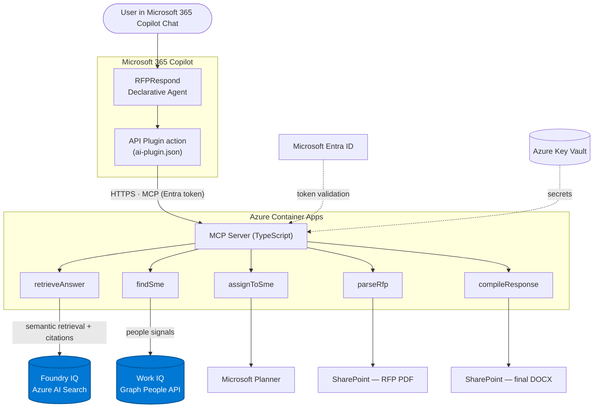

# RFPRespond — Enterprise Agent for Microsoft 365 Copilot

> **Agents League Hackathon · Enterprise Agents Track · June 2026**

RFPRespond turns a 100-question RFP or security questionnaire into a fully-drafted, cited response — directly inside Microsoft 365 Copilot Chat. It pulls answers from your company's past proposals and policy library (Foundry IQ), routes tough questions to the right subject-matter experts (Work IQ), and compiles the final DOCX to SharePoint with a single command.

---

## Why RFPRespond?

Proposal and sales teams spend **30–80 hours per RFP**. Most of that time is spent searching for past answers, chasing SMEs, and reformatting documents. RFPRespond eliminates that toil:

| Without RFPRespond | With RFPRespond |
|---|---|
| 40–80 hrs per questionnaire | < 2 hrs (review + approve) |
| Manual search across SharePoint, email, wikis | Foundry IQ retrieval with citations |
| Emails to SMEs, waiting days for replies | Automatic Planner task assignment |
| Manual DOCX formatting | One-command compile + upload |

---

## Architecture



> The two blue-highlighted nodes are the required **Microsoft IQ** layers.

**Microsoft IQ layers used**
- **Foundry IQ** — semantic knowledge retrieval over the company corpus (Azure AI Search), returning answers with **citations and confidence scores**. Powers `retrieveAnswer`.
- **Work IQ** — Microsoft Graph **People API** + document-usage insights to identify and rank the right subject-matter expert per topic. Powers `findSme`.


---

## Prerequisites

| Requirement | Notes |
|---|---|
| Microsoft 365 Copilot license or Copilot Free | For testing the agent in Copilot Chat |
| M365 tenant with sideloading enabled | Use [M365 Developer Program](https://developer.microsoft.com/microsoft-365/dev-program) tenant |
| Azure subscription | For Container Apps + Key Vault |
| Node.js 20+ | Server runtime |
| Azure CLI (`az`) | Infrastructure provisioning |
| Azure Developer CLI (`azd`) | One-command deploy |
| VS Code + [Microsoft 365 Agents Toolkit](https://aka.ms/m365-agents-toolkit) | Agent publish |

---

## Quick Start (Local Dev)

### 1. Clone and install

```bash
git clone <your-repo-url>
cd rfp-respond/server
npm install
```

### 2. Configure environment

```bash
cp agent/env/.env.dev agent/env/.env.local
# Edit .env.local with your tenant and Azure values
```

### 3. Start the MCP server locally

```bash
cd server
npm run dev
# Server starts on http://localhost:3978
# Health check: http://localhost:3978/health
```

### 4. Launch the agent in VS Code

1. Open the repo root in VS Code.
2. Open the **Agents Toolkit** sidebar.
3. Under **Lifecycle**, click **Provision** (signs into your M365 tenant).
4. Press `F5` to launch — this opens a Dev Tunnel and sideloads the agent to Copilot Chat.

### 5. Test in Copilot Chat

```
> Here's our RFP from Acme Corp [attach PDF from SharePoint].
  Please draft answers for the Security section.
```

---

## Deploy to Azure (Production)

### Step 1 — Login and initialize

```bash
az login
azd auth login
azd env new rfp-respond-prod
```

### Step 2 — Configure secrets

```bash
azd env set FOUNDRY_IQ_ENDPOINT "https://YOUR_FOUNDRY_ENDPOINT/indexes/rfp-corpus"
azd env set ENTRA_TENANT_ID    "YOUR_TENANT_GUID"
azd env set ENTRA_CLIENT_ID    "YOUR_MCP_APP_CLIENT_ID"
azd env set PLANNER_PLAN_ID    "YOUR_PLANNER_PLAN_ID"

# Secrets go into Key Vault (not plain env vars)
az keyvault secret set --vault-name "kv-YOUR_ENV" --name "foundry-iq-key"   --value "YOUR_FOUNDRY_IQ_KEY"
az keyvault secret set --vault-name "kv-YOUR_ENV" --name "entra-client-secret" --value "YOUR_CLIENT_SECRET"
```

### Step 3 — Deploy infrastructure + server

```bash
azd up
# Provisions: Resource Group, Container Registry, Key Vault, Log Analytics, Container Apps Environment, Container App
# Builds and pushes Docker image
# Deploys MCP server
# Outputs: MCP_SERVER_URL
```

### Step 4 — Register Entra app registrations

In Azure Portal → Microsoft Entra ID → App Registrations:

**App 1: RFPRespond-MCP** (the server)
- Expose an API: add scope `RFPRespond.Access`
- Grant admin consent

**App 2: RFPRespond-DA** (the Copilot agent client)
- Add delegated permissions:
  - `Files.ReadWrite.All`
  - `Tasks.ReadWrite`
  - `People.Read`
  - `Sites.ReadWrite.All`
  - `RFPRespond.Access` (from App 1)
- Grant admin consent
- Copy the Client ID into `agent/env/.env.local` → `AAD_APP_CLIENT_ID`

### Step 5 — Index your corpus in Foundry IQ

1. In the Foundry portal, create a **Knowledge Source** of type SharePoint.
2. Point it at your `RFPCorpus` library.
3. Set the semantic configuration name to `rfp-corpus-semantic`.
4. Let indexing complete (typically < 10 minutes for the sample set).
5. Copy the endpoint URL to `FOUNDRY_IQ_ENDPOINT`.

### Step 6 — Update agent manifest and publish

1. Set `MCP_SERVER_URL` in `agent/env/.env.local` to the `azd up` output URL.
2. In VS Code Agents Toolkit → **Lifecycle** → **Provision** → **Publish to current tenant**.
3. In M365 Copilot Chat → Agents picker → Install **RFPRespond**.
4. First use prompts for OAuth consent to Graph and MCP server scopes.

### Step 7 — Smoke test

```
> Here's our RFP from Acme Corp [attach PDF].
  Please draft answers for the security section and route any
  question about SOC 2 to our compliance lead.
```

Expected output:
- Parsed question list
- Cited draft answers
- Low-confidence questions flagged with "NEEDS REVIEW"
- Planner tasks created for SME assignment
- Offer to compile and upload final DOCX

---

## Populate the Knowledge Base

Upload the sample corpus files to SharePoint first:

1. Go to `https://YOUR_TENANT.sharepoint.com/sites/RFPCorpus`
2. Create a `Documents/RFPCorpus/` folder
3. Upload all files from `./sample-corpus/` (SOC 2, data handling, access control Q&As)
4. Trigger a Foundry IQ re-index

See [sample-corpus/README.md](./sample-corpus/README.md) for instructions on adding your own content.

---

## Project Structure

```
rfp-respond/
├── agent/                          # Declarative Agent
│   ├── appPackage/
│   │   ├── manifest.json           # Teams app manifest
│   │   ├── declarativeAgent.json   # DA instructions, knowledge, actions
│   │   ├── ai-plugin.json          # MCP plugin descriptor
│   │   └── aad.manifest.json       # Entra app manifest
│   ├── env/
│   │   └── .env.dev                # Environment template
│   └── teamsapp.yml                # Agents Toolkit project file
├── server/                         # MCP Server (TypeScript)
│   ├── src/
│   │   ├── index.ts                # MCP + Express entrypoint
│   │   ├── auth/entra.ts           # Entra OAuth token validation
│   │   └── tools/
│   │       ├── parseRfp.ts         # PDF → question list
│   │       ├── retrieveAnswer.ts   # Foundry IQ retrieval
│   │       ├── findSme.ts          # Work IQ expert finder
│   │       ├── assignToSme.ts      # Planner task creation
│   │       └── compileResponse.ts  # DOCX build + SharePoint upload
│   ├── Dockerfile
│   ├── package.json
│   └── tsconfig.json
├── infra/
│   ├── main.bicep                  # Container Apps + ACR + Key Vault
│   └── main.parameters.json
├── sample-corpus/                  # Public-domain Q&A for initial indexing
│   ├── soc2-qa.md
│   ├── data-handling-qa.md
│   └── access-control-qa.md
├── azure.yaml                      # azd project definition
├── README.md
├── SECURITY.md
└── LICENSE                         # MIT
```

---

## Hackathon Compliance

| Requirement | Status |
|---|---|
| Enterprise Agents track (M365 Copilot) | ✅ Declarative Agent extending Copilot Chat |
| Microsoft IQ integration | ✅ Foundry IQ (retrieval) + Work IQ (people graph) |
| Entra OAuth on MCP server | ✅ `jwks-rsa` + `jsonwebtoken` Bearer token validation |
| No proprietary/paid libraries | ✅ All dependencies are MIT/Apache open-source |
| No confidential data | ✅ Sample corpus is public-domain (SIG Lite, CAIQ) |
| Public repo + README | ✅ This file |
| SECURITY.md | ✅ [See SECURITY.md](./SECURITY.md) |
| MIT LICENSE | ✅ [See LICENSE](./LICENSE) |

---

## License

[MIT](./LICENSE) — see LICENSE for details.

Built for the **Agents League Hackathon** (June 4–14, 2026) · Enterprise Agents Track
